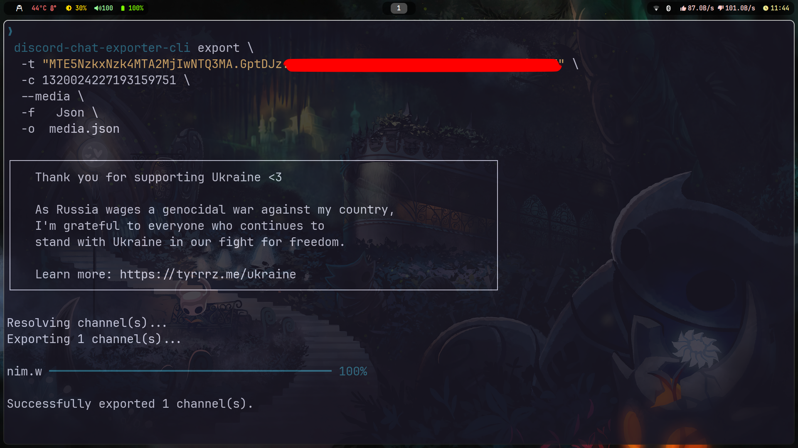
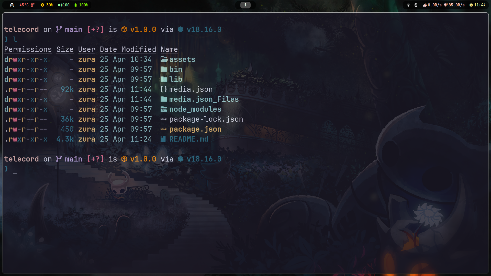
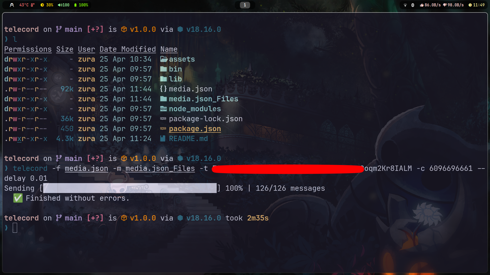
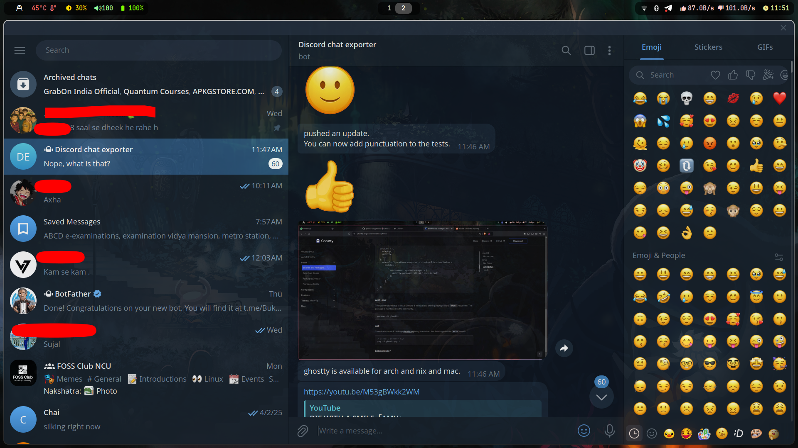
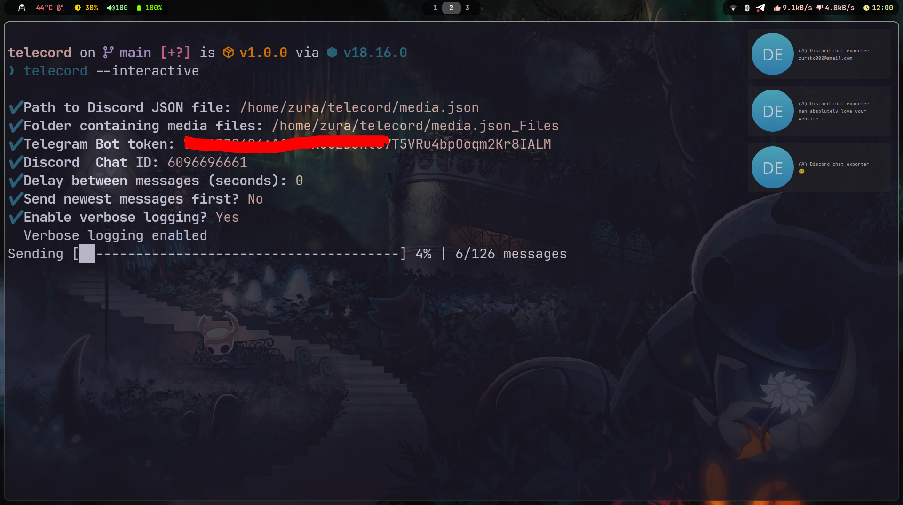
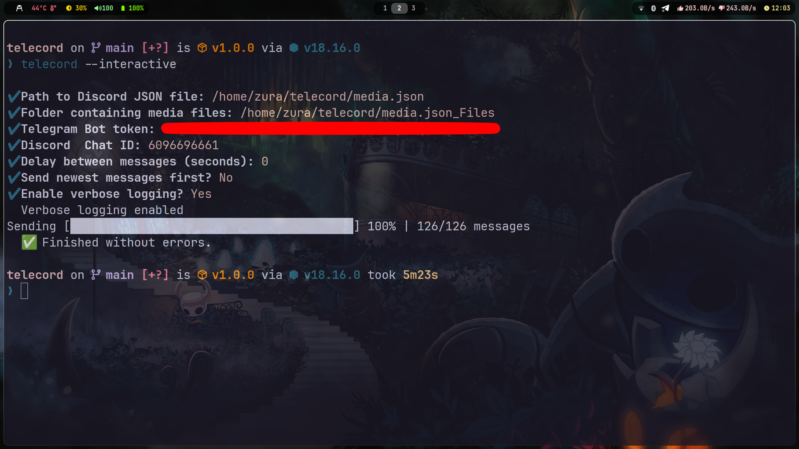

# 📤 Telecord

**Export Discord chats (JSON + media) to Telegram using a simple CLI tool.**

> ⚠️ This tool depends on [`discord-chat-exporter-cli`](https://github.com/Tyrrrz/DiscordChatExporter) for exporting your Discord messages first. Make sure to install and use that before proceeding.

--- 

## ✨ Features

*   **Export Discord chats to Telegram:** The core functionality of the tool.
*   **Supports Media:** Export images, videos, and other attachments along with your messages.
*   **Interactive & CLI Modes:** Use the interactive mode for a step-by-step guide or the CLI for automation.
*   **Customizable Message Delay:** Set a delay between messages to avoid rate limiting.
*   **Reverse Message Order:** Send messages from newest to oldest.
*   **Verbose Logging:** Enable detailed logs for debugging.

--- 

## 📦 What You Need First

### 1. Install [`discord-chat-exporter-cli`](https://github.com/Tyrrrz/DiscordChatExporter)

Download a standalone binary from their [Releases page](https://github.com/Tyrrrz/DiscordChatExporter/releases).

### 2. Get your Discord Token

You'll need your Discord token to export your chat history. You can find guides on how to get your token online. Please be careful with your token and do not share it with anyone.

### 3. Get your Telegram Bot Token and Chat ID

You'll need a Telegram bot token and a chat ID to send messages to your Telegram chat.

*   **Bot Token:** Create a new bot by talking to the [BotFather](https://t.me/botfather) on Telegram. He will give you a token.
*   **Chat ID:** You can get your chat ID by talking to the `@userinfobot` on Telegram.

### 4. Export your Discord chat

```bash
discord-chat-exporter-cli export \
  -t "YOUR_DISCORD_TOKEN" \
  -c DISCORD_CHANNEL_ID \
  --media \
  -f Json \
  -o media.json
```

> This will create:
> - `media.json` – your exported messages
> - `media.json_Files/` – folder containing any media (images, attachments, etc.)

--- 

## 🛠 Installation

Telecord is available on several platforms. Choose the one that best suits your system.

### Arch Linux (AUR)

If you're on Arch or an Arch-based distro, you can install `telecord` from the Arch User Repository.

```bash
# Using yay
yay -S telecord

# Using paru
paru -S telecord
```

### Debian / Ubuntu (.deb package)

You can build a `.deb` package from the source.

1.  **Install build dependencies:**
    ```bash
    sudo apt update && sudo apt install build-essential debhelper devscripts
    ```

2.  **Clone the repository and build the package:**
    ```bash
    git clone https://github.com/vinayydv3695/telecord.git
    cd telecord
    dpkg-buildpackage -us -uc
    ```

3.  **Install the generated package:**
    The command will create a `.deb` file in the parent directory. Install it using `dpkg`. The version number may vary.
    ```bash
    sudo dpkg -i ../telecord_1.0.0-1_all.deb
    ```

### Nix / NixOS

If you use the Nix package manager, you can build and install `telecord` directly from the repository.

1.  **Build the package:**
    This command will build the package and create a `./result` symlink to the output in the Nix store.
    ```bash
    nix-build
    ```

2.  **Install the package into your profile:**
    This makes the `telecord` command available in your shell.
    ```bash
    nix-env -i -f .
    ```

### Manual Installation (Any System)

If your system isn't listed above, you can install the tool manually with Node.js and npm.

**Prerequisites:**
*   [Node.js](https://nodejs.org/) (v14 or higher)
*   [npm](https://www.npmjs.com/)

```bash
git clone https://github.com/Vinayydv3695/telecord
cd telecord
npm install
npm link
```
> `npm link` creates a global symlink, allowing you to run `telecord` from any directory.

--- 

## 🚀 Usage

### Basic CLI Mode

```bash
telecord -f media.json -m media.json_Files -t <TELEGRAM_BOT_TOKEN> -c <CHAT_ID>
```

### Options

| Option              | Alias | Description                                     |
|---------------------|-------|-------------------------------------------------|
| `--file <path>`     | `-f`  | Path to Discord JSON file                       |
| `--media <path>`    | `-m`  | Path to media folder (e.g., `media.json_Files`) |
| `--token <string>`  | `-t`  | Your Telegram bot token                         |
| `--chat <id>`       | `-c`  | Telegram Chat ID (e.g., `-1001234567890`)       |
| `--delay <seconds>` | `-d`  | Delay between messages (default: 1)             |
| `--reverse`         | `-r`  | Send messages from newest to oldest             |
| `--verbose`         | `-v`  | Enable detailed logs                            |
| `--interactive`     |       | Launch step-by-step mode                        |

--- 

## 🧙 Interactive Mode

No need to remember flags. Just run:

```bash
telecord --interactive
```

You'll be prompted step-by-step:

```
✔ Path to Discord JSON file
✔ Folder containing media files
✔ Telegram Bot token
✔ Telegram chat ID
✔ Delay between messages
✔ Send newest messages first?
✔ Enable verbose logging?
```

--- 

## 🧪 Examples

**Basic usage:**
```bash
telecord -f media.json -m media.json_Files -t 123456:ABCDEF123 -c -1009876543210
```

**With a 0.5 second delay and reversed order:**
```bash
telecord -f media.json -m media.json_Files -t 123456:ABCDEF123 -c -1009876543210 --delay 0.5 --reverse
```

--- 

## ⚙️ How It Works

1. You export your messages from Discord using `discord-chat-exporter-cli`
2. Telecord parses the `.json` file
3. Media files are uploaded first
4. Messages are then sent one-by-one to your Telegram chat
5. You can control the delay, order, and see progress in real-time

It uses:
- Telegram's Bot API (via [Axios](https://github.com/axios/axios))
- Graceful error handling
- Verbose logging for debugging

--- 

## 📸 Screenshots

> Real screenshots of Telecord in action:


<br/>

<br/>

<br/>

<br/>

<br/>


--- 

## 🤔 Troubleshooting

*   **401 Unauthorized Error:** This usually means your Telegram bot token is incorrect. Double-check your token and try again.
*   **File not found:** Make sure you're providing the correct path to your `media.json` file and `media.json_Files` folder.
*   **Rate-limiting:** If you're sending a lot of messages, you might get rate-limited by the Telegram API. Try increasing the delay between messages using the `--delay` option.

--- 

## 🤝 Contributing

Contributions are welcome! If you have any ideas, suggestions, or bug reports, please open an issue on the [GitHub repository](https://github.com/vinayydv3695/telecord/issues).

--- 

## 🧾 License

MIT License

```
Copyright (c) 2025 Vinay

Permission is hereby granted, free of charge, to any person obtaining a copy
of this software and associated documentation files (the “Software”), to deal
in the Software without restriction, including without limitation the rights
to use, copy, modify, merge, publish, distribute, sublicense, and/or sell
copies of the Software, and to permit persons to whom the Software is
furnished to do so, subject to the following conditions:

The above copyright notice and this permission notice shall be included in
all copies or substantial portions of the Software.

THE SOFTWARE IS PROVIDED “AS IS”, WITHOUT WARRANTY OF ANY KIND, EXPRESS OR
IMPLIED, INCLUDING BUT NOT LIMITED TO THE WARRANTIES OF MERCHANTABILITY,
FITNESS FOR A PARTICULAR PURPOSE AND NONINFRINGEMENT. IN NO EVENT SHALL THE
AUTHORS OR COPYRIGHT HOLDERS BE LIABLE FOR ANY CLAIM, DAMAGES OR OTHER
LIABILITY, WHETHER IN AN ACTION OF CONTRACT, TORT OR OTHERWISE, ARISING FROM,
OUT OF OR IN CONNECTION WITH THE SOFTWARE OR THE USE OR OTHER DEALINGS IN
THE SOFTWARE.
```

--- 

## 👤 Author

Made with ❤️ by **Vinay**  
[GitHub – @vinayydv3695](https://github.com/Vinayydv3695)

```